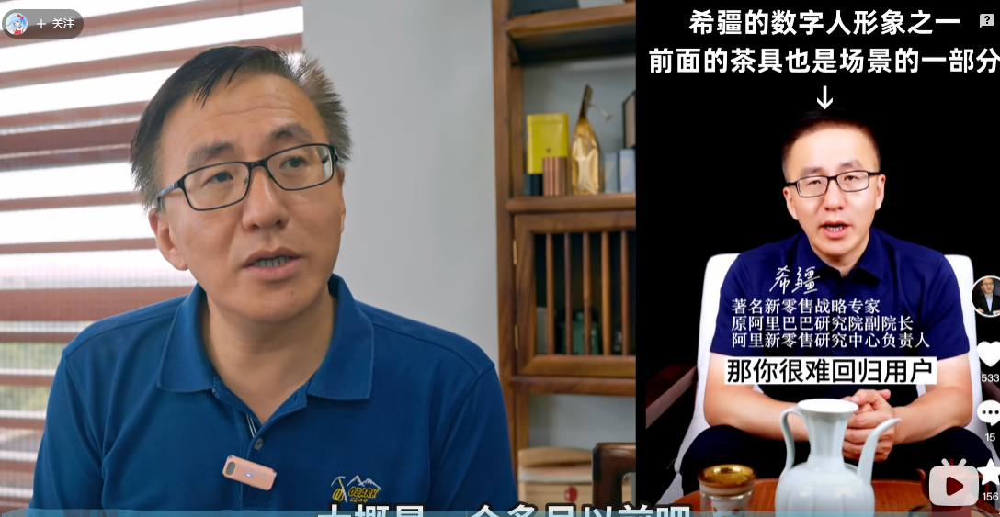
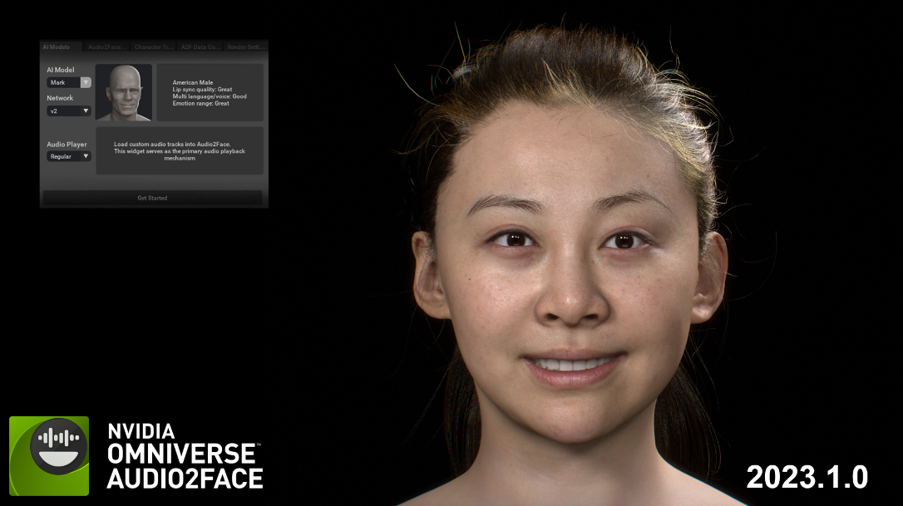
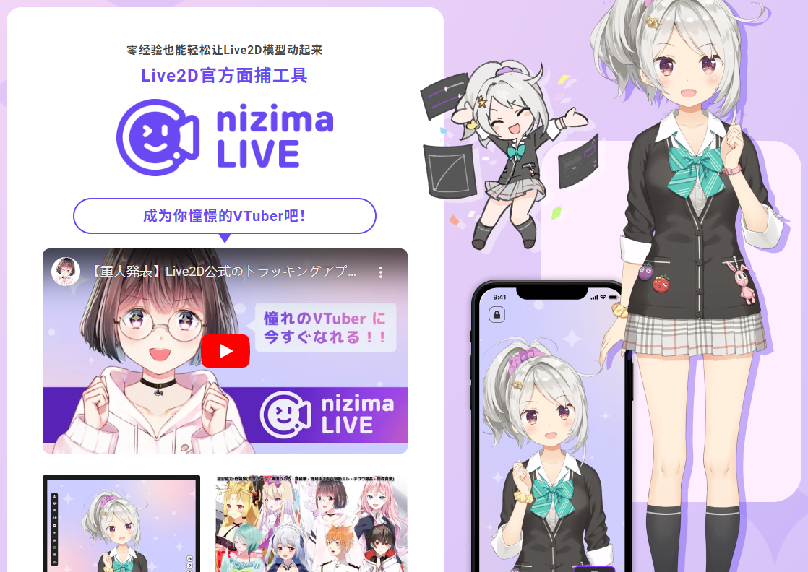
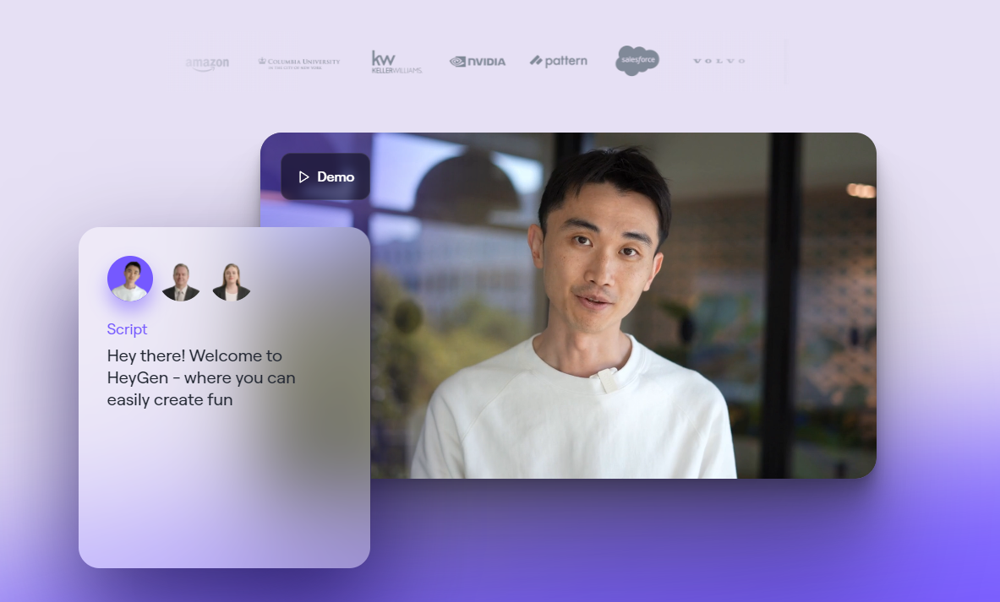
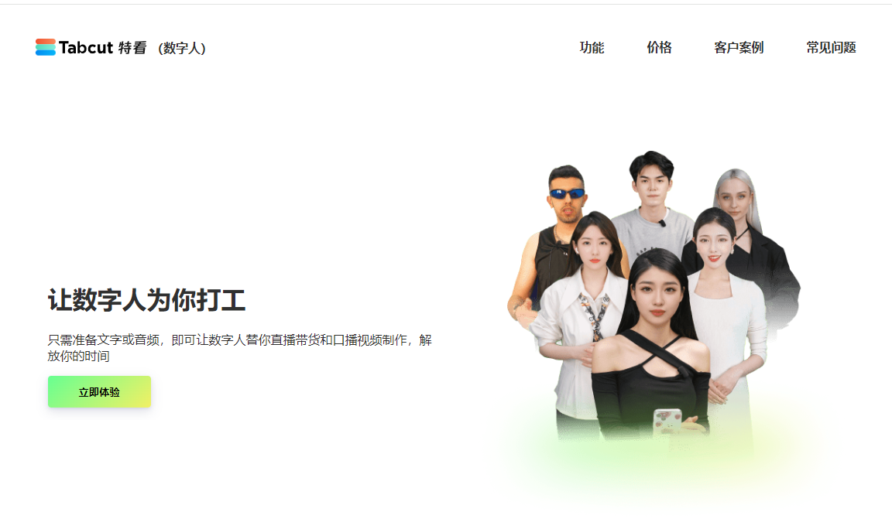
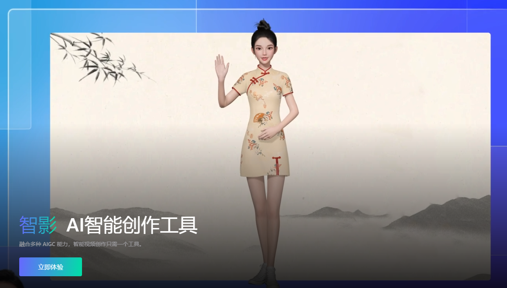
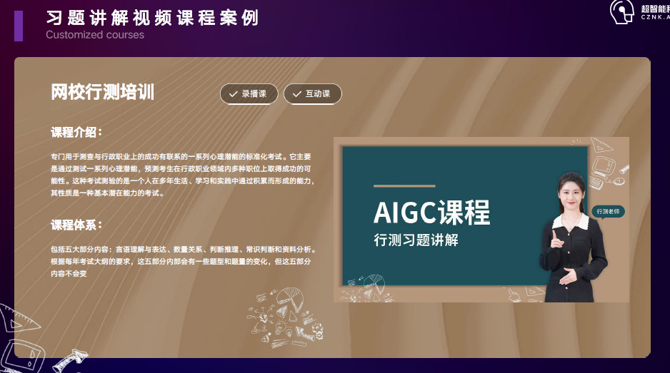
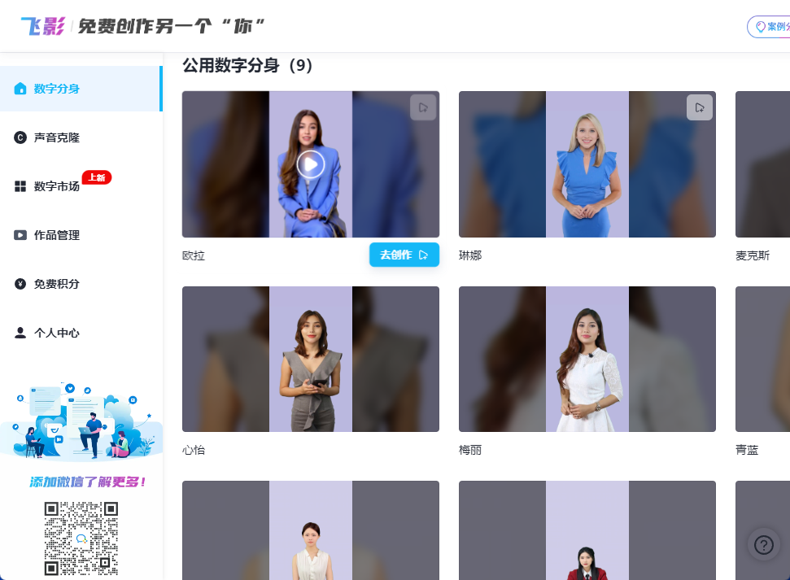

# Summary of Major Technologies in Digital Humans

[**中文**](./README.md) | **English**  

Currently, digital humans mainly encompass aspects of appearance, voice, and conversational abilities. The primary mode of interaction is through direct conversation with the digital human. The following has been collected and summarized from various sources in order to provide quick-start assistance.

---

***Update the digital human icon for a visual presentation of the various technologies and representative solutions involved in the input and output process.***

The public sharing link is as follows. Feel free to modify and improve: https://www.processon.com/embed/60051bca7d9c084cf9ec5dad?cid=60051bca7d9c084cf9ec5dae

---

## Demo Project
### Digital Human Academic Presentation

Generate high-quality academic and product report videos using minimal raw materials. Required materials: (1) A photo of a real person, (2) A 10-second audio clip of the person in any language, and (3) The original PPT to generate a digital human academic report.

https://github.com/user-attachments/assets/ad846bff-18ac-4bc0-b964-b6c668db6968  
https://github.com/user-attachments/assets/1aadcc4f-46b4-4097-aeb0-03307b83da6f  

#### 1. Text Preparation:
Use GPT-4o or other visual AI models to customize prompts (e.g., "Help me generate a verbatim speech script as xx, with a relaxed tone. I will upload it page by page, please ensure coherence between pages, etc."). Upload the PPT page by page to get the speech script. (Continuous optimization is required for the best results)

#### 2. Voice Cloning:
Clone the voice using a voice engine. Open-source solution: CosyVoice (80/100), Closed-source solution: HeyGen (current choice, 90/100).

#### 3. Photo-Driven Digital Human Raw Video
##### 3.1 Use Alibaba Cloud PAI ArtLab to generate cartoon-like digital human images.
Project introduction: https://mp.weixin.qq.com/s/DaP9rvW6A9jx1GoLyU0zHQ  
Direct link: https://x.sm.cn/GEGDfU9  
The advantage of this method is that it generates a digital human that, while remaining realistic, carries a cartoonish aspect, significantly reducing the uncanny valley effect (feedback from all viewers).

##### 3.2 Photo-Driven
Open-source solution: 50-70/100, Closed-source solution: HeyGen (current choice, 90/100).

#### 4. Post-Production Composition
After keying out the digital human, combine it with each page of the PPT.  
Optimization: If imperfections are noticed during keying, try filling in the PNG photo materials with a white background using software like Photoshop.

#### 5. Multi-language Support
Use translation software like FanyiGou (fanyigou.com) to translate the PPT into multiple languages. Tested results show good quality. Translate the verbatim script into the corresponding language, clone the voice to match the language, and synthesize accordingly.

---

## 0. Real-Time Perceptual Interaction Abilities

### 0.1 GPT-4o

With the release of a series of demonstration videos for [GPT-4o](https://openai.com/index/hello-gpt-4o/), real-time issues have been nearly resolved. By combining real-time conversation, interruption, proactive questioning, and real-time analysis of camera content with local knowledge bases and Agent capabilities, digital humans have reached a higher level of usability.

**Scenarios where no physical appearance is needed (wearable devices: real-time collection, cloud processing, voice and image feedback):**

- Personal real-time assistant
- Assistant for the visually impaired
- Translation assistant
- Student learning tutor
- Others (feel free to add more)

**Scenarios requiring a physical appearance:**

- Empowering digital humans, although current technology cannot solve interaction abilities such as applying lipstick in real-time or multi-angle movement under free cameras.
- Empowering physical robots, such as autonomous decision-making for rescue robots and communication with controllers through natural language or specific syntax.
- Others

Currently, OpenAI **has not yet provided the API for sound and video as demonstrated**, only offering text dialogue and image recognition capabilities for GPT-4o, which is not significantly different from previous versions like GPT4-Vision-Preview.

Demo video:

<https://player.bilibili.com/player.html?isOutside=true&aid=1454557368&bvid=BV1Vi421X7Xf&cid=1544530003&p=1>

### 0.2 Other Implementations

tbd

## 1. Appearance Driven

### 1.1 Real Person Recording + Algorithmic Drive

Real person records video material, and later uses AI to drive lip movements and postures to create the digital human.

- Advantages: Difficult to distinguish from real (since it is directly recorded real person material), accurate lip-syncing, can be live or pre-recorded.
- Disadvantages: Expensive (possibly)

> In this image, the right side is a digital human, and the left side is a real person.

Demo video:

<https://player.bilibili.com/player.html?isOutside=true&aid=701718909&bvid=BV1vm4y1x7nm&cid=1217022011&p=1>

---

**Related Technologies:**

- Lip Sync Technology (Representatives: [Wav2Lip](https://github.com/Rudrabha/Wav2Lip), [HeyGen](https://www.heygen.com/), [rask.ai](https://rask.ai/))
- Real-time Video Face Swap (Representatives: [DeepFakeLive](https://www.deepfakevfx.com/downloads/deepfacelive/), [FaceFusion](https://github.com/facefusion/facefusion), [fal.ai](https://fal.ai/models/fal-ai/fast-turbo-diffusion/playground))
- Image to Video (Representatives: [MuseTalk](https://github.com/TMElyralab/MuseTalk), [Sadtalker](https://github.com/OpenTalker/SadTalker))

### 1.2 Modeling + Algorithmic Drive

Modeling offers higher flexibility, with various methods ranging from high-precision to low-precision modeling, and can also create cartoon images.

**Representative Technologies:**

[Meta Human](https://www.unrealengine.com/en-US/metahuman)  

[NVIDIA Omniverse Audio2Face](https://www.nvidia.com/en-us/omniverse/apps/audio2face/)  

[Live2D](https://www.live2d.com/en/)  

[Adobe Character Animator](https://www.adobe.com/hk_en/products/character-animator.html)  

## 2. Voice Imitation

**Some non-professional background knowledge:**  
The voice of a digital human can use existing TTS models or self-trained voice models. The acoustic model is an essential part of the voice synthesis system.

Mainstream acoustic models include [VITS](https://github.com/jaywalnut310/vits), [Tacotron](https://github.com/NVIDIA/DeepLearningExamples/tree/master/PyTorch/SpeechSynthesis/Tacotron2), and [FastSpeech2](https://github.com/ming024/FastSpeech2). VITS (Variational Inference with adversarial learning for end-to-end Text-to-Speech) is a speech synthesis method that uses a pre-trained vocoder to convert text into speech.

The previously popular AI Stefanie Sun, for example, used the [so-vits-svc](https://github.com/svc-develop-team/so-vits-svc/tree/4.1-Stable) technology, which stands for SoftVC VITS Singing Voice Conversion. This technology was modified by a voice enthusiast based on [softVC](https://github.com/bshall/soft-vc) and [VITS](https://github.com/jaywalnut310/vits).

### Hot Projects Related to Voice Imitation (as of June 2024)

**1. GPT-SoVITS** *27.0K stars*  
Voice model training project, can fine-tune models with a small amount of text, provides WebUI.

**Project address:** <https://github.com/RVC-Boss/GPT-SoVITS>  

**Demo video:**

<https://player.bilibili.com/player.html?isOutside=true&aid=836354039&bvid=BV12g4y1m7Uw&cid=1406840960&p=1>

**2. so-vits-svc** *24.4K stars*  
Voice model training project, representative: AI Stefanie Sun.

**Project address:** <https://github.com/svc-develop-team/so-vits-svc>  

**Demo video:**

<https://player.bilibili.com/player.html?isOutside=true&aid=572772327&bvid=BV1Mz4y1p7hY&cid=1178460068&p=1>

**3. ChatTTS** *23.3K stars*  
Not voice cloning, but its text-to-speech results are excellent, with pauses, intonation, and emotion. Native Chinese support. Various one-click deployment packages and lazy packages are available for Windows, Linux, etc.

**Project address:** <https://github.com/2noise/ChatTTS>  

**Demo video:**

<https://player.bilibili.com/player.html?isOutside=true&aid=1055092304&bvid=BV1zn4y1o7iV&cid=1561584918&p=1>

**Others:** [CapCut Voice Cloning](https://www.capcut.cn/), [Reecho](https://www.reecho.ai/), [Emotional VITS](https://github.com/innnky/emotional-vits), [Bark](https://github.com/suno-ai/bark)

## 3. Interaction Technology

**tbd**  
*Such as multi-camera and multi-angle digital humans, real-time dressing, makeup, etc.*

## 4. Application Scenarios and Comprehensive Representative Projects

Digital humans have applications in self-media (knowledge science popularization and related hosts), e-commerce live streaming, and education. There is also exploration in areas like digital life (deceased relatives) combined with AR and VR. Additionally, the integration of digital human technology and physical robots is also within the scope.

**Representative Projects:**

1. [AI-Vtuber](https://github.com/Ikaros-521/AI-Vtuber)  
[Open Source] AI Vtuber is a virtual AI host driven by large models, integrating appearance and voice.

2. [Fay](https://github.com/TheRamU/Fay)  
[Open Source] Fay is a complete open-source project, including Fay controller and digital human model, which can be flexibly combined for different application scenarios: virtual host, live sales, product guide, voice assistant, remote voice assistant, digital human interaction, digital human interviewer and psychological evaluation, Jarvis, Her.

3. [HeyGen](https://www.heygen.com/)  
[Overseas/Chinese-founded]a popular platform that offers various related features, including digital avatars and voice cloning.  

4. [Tekan Technology](https://www.zhubobao.com/)  
[Domestic Commercial] High-quality digital human based on real-person video  

5. [Tencent Zhiying](https://zenvideo.qq.com/)  
[Domestic Commercial] A comprehensive creation platform integrating various AIGC capabilities.  

6. [CZNK.AI](https://mp.weixin.qq.com/s/etcD4SEMznBctOjuNJty2A)  
[Domestic Commercial] AIGC Course Content Production Representative, Providing a One-Stop Platform for Content Production and Services  

7. [hifly](https://hifly.cc)  
[Domestic Commercial] Offers various features, including digital avatars and voice cloning.  

## 5. Laws, Regulations, and Representative News

- **[Regulations on the Management of Deep Synthesis of Internet Information Services](https://www.gov.cn/zhengce/zhengceku/2022-12/12/content_5731431.htm)**  
*Providers of deep synthesis services and technical supporters offering services that generate or significantly alter information content with intelligent dialogue, synthetic voices, facial generation, immersive realistic scenarios, etc., should prominently identify the services to avoid public confusion or misidentification.*

- **[Beijing Action Plan for Promoting the Innovative Development of the Digital Human Industry](https://www.beijing.gov.cn/zhengce/zhengcefagui/202208/W020220808406785112297.pdf)**  
*The Beijing Municipal Bureau of Economy and Information Technology issued the first domestic special support policy for the digital human industry - "Beijing Action Plan for Promoting the Innovative Development of the Digital Human Industry (2022-2025)".*
- **[How are Large Models and Digital Human Technologies Applied in the Field of Education?](https://learning.sohu.com/a/713671752_120619005)**  
*"Using technology to promote education development and benefit more people is our original intention. Building more effective, efficient, and experiential education allows learners worldwide to enjoy high-quality digital educational resources."  
On August 20, at the 2023 Global Smart Education Conference, Chen Changjie, Vice President of the Smart Learning Institute of Beijing Normal University and Vice President of NetDragon, expressed this in an interview with the media.*

- **[Global Future Education Design Competition](https://gcd4fe.bnu.edu.cn/)** Project Practical Experience Instruction Document (AIGC Summer Camp & GCD4FE 48H)
*<https://yuanzhuo.bnu.edu.cn/downloads/gcd4fe_ai_story.html>*

## 6. The Brain of Digital Humans: Large Language Models

### The main multimodal models currently supporting image recognition and processing include

gpt-4o, gpt-4-vision-preview, gemini-pro-vision, Zhipu GLM-4V, Lingyi Technology yi-vl-plus, Tongyi Qwen-VL-Max, LLaVA (open source), etc.

### API Application Addresses for Various Models

- Baidu  
<https://console.bce.baidu.com/qianfan/ais/console/applicationConsole/application>

- 360  
<https://ai.360.com/open>

- Qwen  
<https://dashscope.console.aliyun.com/overview>

- Xinghuo  
<https://console.xfyun.cn/services/bm35>

- Zhipu  
<https://open.bigmodel.cn/overview>

- Moonshot AI  
<https://platform.moonshot.cn/console/api-keys>

- Hunyuan  
<https://console.cloud.tencent.com/cam/capi>

- Baichuan  
<https://platform.baichuan-ai.com/console/apikey>

- MiniMax  
<https://www.minimaxi.com/user-center/basic-information/interface-key>

- Lingyi  
<https://platform.lingyiwanwu.com/apikeys>

- Jieyue Xingchen  
<https://platform.stepfun.com>

- Claude  
<https://www.anthropic.com/api>

- Gemini  
<https://ai.google.dev/gemini-api/docs/api-key>

### Open-Source Large Model Integration Frontends

- **Open-WebUI** Provides a rich-featured WebUI, integrates various large models, has user group functionality, and allows administrators to easily manage multiple users and collect detailed user usage data.  
<https://github.com/open-webui/open-webui>

- **Jan** Provides multi-platform clients, integrates various open-source and API models, and features a simple and aesthetically pleasing UI  
<https://github.com/janhq/jan>

- **Langchain-Chatchat** Provides multi-model support and RAG, agent functions through WebUI.  
<https://github.com/chatchat-space/Langchain-Chatchat>

### Large Model API Integration Management Gateways

- Ollama  
<https://ollama.com>

- LiteLLM  
<https://litellm.vercel.app>

- VLLM  
<https://docs.vllm.ai/en/latest/index.html>

- OneAPI  
<https://github.com/songquanpeng/one-api>

- Gateway  
<https://github.com/Portkey-AI/gateway>

### Local Knowledge Base and Intelligent Agent Construction

- FastGPT  
<https://github.com/labring/FastGPT>

- dify  
<https://github.com/langgenius/dify>

- Coze  
<https://www.coze.cn>  
<https://www.coze.com>

### Large Model Automation Evaluation Tools

- OpenCompass  
<https://github.com/open-compass/opencompass>
